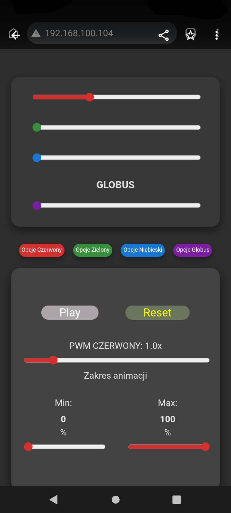
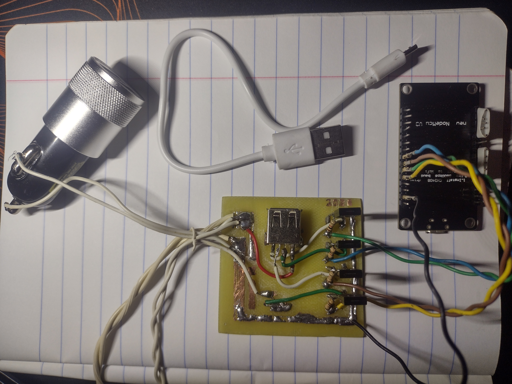
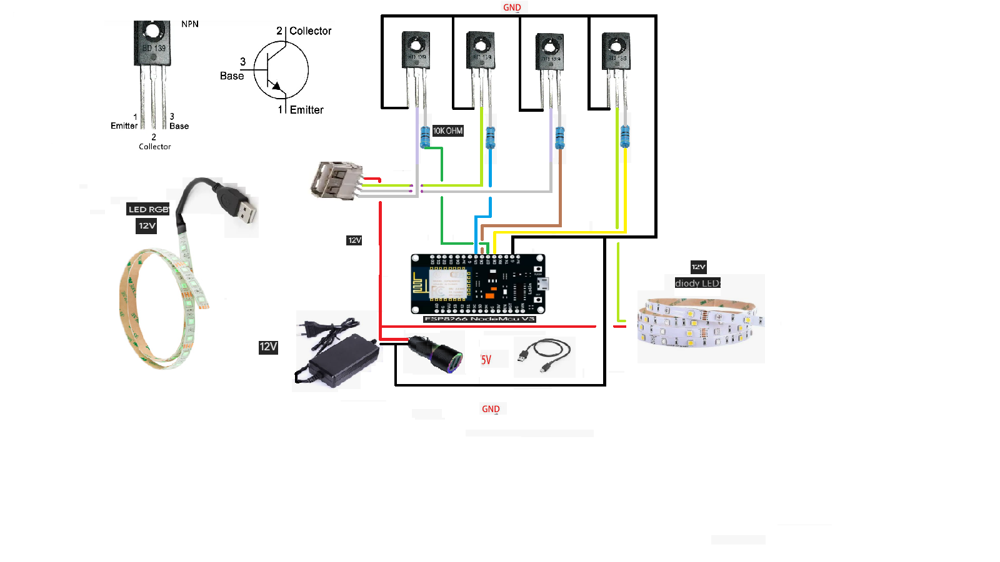

         Sterownik Taśm LED RGB na ESP8266 (4-kanałowy)

Projekt sterownika PWM dla taśm LED 12V oparty na module NodeMCU (ESP8266). 
Pozwala na zdalne sterowanie jasnością 4 niezależnych kanałów (np. R, G, B, W) poprzez przeglądarkę internetową.

--> Zdjęcia projektu

-- Interfejs użytkownika (przeglądarka w telefonie):

-- Płytka PCB:

--> Funkcje

- **Sterowanie 4 kanałami PWM** (np. Czerwony, Zielony, Niebieski, białe LED).
- Wbudowany serwer WWW** – nie wymaga zewnętrznej aplikacji.
- Regulacja jasności** w zakresie 0–100%.
- Tryb animacji** („Play/Pause”) z regulacją prędkości oraz zakresu (Min/Max) – osobno dla każdego kanału.
- Zasilanie:** 12V dla taśm LED, 5V dla logiki ESP8266.

--> Budowa i schemat

Projekt wykorzystuje 4 tranzystory NPN (BD139) do sterowania taśmami 12V. 
Moduł NodeMCU generuje sygnał PWM, który poprzez rezystory trafia na bazy tranzystorów.

--> Schemat połączeń

--> Piny PWM

| Kanał | Pin NodeMCU | GPIO |
|-------|-------------|------|
| Czerwony | D5 | GPIO14 |
| Zielony | D6 | GPIO12 |
| Niebieski | D7 | GPIO13 |
| Globus / białe LED | D8 | GPIO15 |

--> Jak używać

1. Wgraj kod `sper_led.ino` na płytkę NodeMCU.
2. W kodzie ustaw swoje dane WiFi (`ssid` i `password`):
  
   const char* ssid     = "TWOJA_NAZWA_WIFI";
   const char* password = "TWOJE_HASLO_WIFI";
  
3. Po połączeniu z WiFi odczytaj adres IP z Serial Monitora (115200 baud).
4. Wpisz adres IP w przeglądarce na telefonie lub komputerze.
5. Ciesz się sterowaniem!

